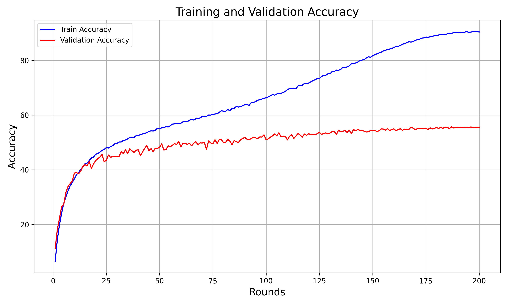
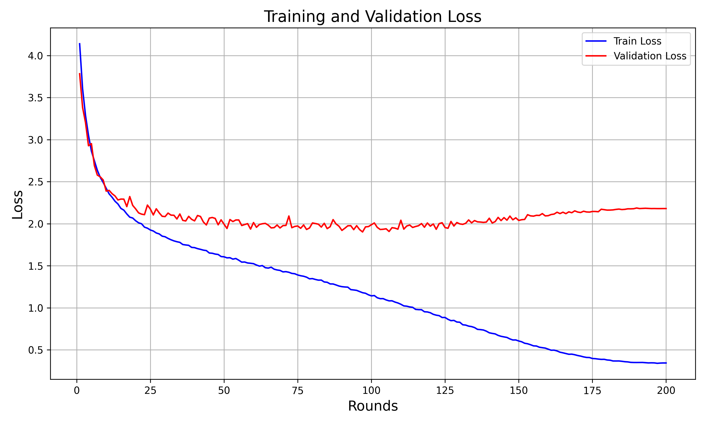

# Report results of experiments on the CIFAR-100 dataset
The first part of the experiments focuses on the centralized setting trained and tested on the CIFAR-100 dataset, which contains 60 thousands 32x32 colored images. 
The model architecture used for the experiments is a modified version of LeNet5, taken from [Hsu et al., Federated Visual Classification with Real-World Data Distribution, ECCV 2020] and consists of a CNN similar to LeNet5 which has two 5×5, 64-channel convolution layers, each precedes a 2×2
max-pooling layer, followed by two fully-connected layers with 384 and 192
channels respectively and finally a softmax linear classifier.   

In the first experiments we have done, we noticed that, during training, the model was overfitting because of the visible gap between training and validation accuracy (the same happened for the losses). Therefore, we decided to introduce data augmentation techniques as done in [ Reddi et al., Adaptive federated optimization. ICLR 2021​]. They are very simple and consists of a random crop of the training images of dimension 32x32 with a padding equal to 4 and a random horizontal flip. The techniques applied solved the problem with overfitting.  

For what concerns hyperparameters tuning, we tried different values of lr and wd, together with 3 different schedulers as required by the track. The values for lr and wd have been picked based on a log-uniform distribution over an interval, more details are in the dedicated section in train_centralized.ipynb.  

The hyperparameters values/schedulers over which we tested our model to find the best configuration are:  
- lr: [0.001,0.01,0.1]
- wd: [0.0001,0.001,0.01,0.1]
- schedulers: StepLR (with gamma = 0.1), Cosine Annealing and Exponential LR (with gamma=0.9). 

The same grid of values is used for hyperparameter tuning in all the experiments of the federated setting as well and won't be fully reported again. For what concerns the federated setting, we were not required to use a scheduler.  

For the centralized version on CIFAR-100, we obtained the best accuracy with lr = 0.01, wd = 0.001 and cosine annealing as scheduler. We report here training and validation accuracy for this specific setting after 200 epochs:  

We reached, with this configuration, an accuracy of 55.65%, but with this high number of epochs the model clearly started to overfit.

Here we show also train and validation losses:  

    

We notice that the model is clearly overfitting towards the end of the training, we could have trained for less epochs.

# Evaluate the effect of client participation
We implemented a skewed client sampling: each client has a different probability of being selected at each round, and can be used to simulate settings in which some clients are more “active” than others. Client selection values are sampled according to a Dirichlet distribution parameterized by an hyperparameter ɣ.
Let's test what happens with different values of gamma:  

**gamma = 0.05** <-- Represents extreme heterogeneity. A small number of clients will dominate the selection process, being chosen almost exclusively, while most clients will rarely participate.  

**gamma = 0.5** <-- Introduces moderate heterogeneity. Some clients have higher selection probabilities than others, but the imbalance is not extreme.  

**gamma = 1**   <-- A standard choice for the Dirichlet distribution. This provides a relatively balanced selection with mild heterogeneity.  

**gamma = 5**   <-- Simulates near-uniform participation, where all clients have almost equal probabilities of being selected.  

# Gamma = 5    

Accuracy reached on the test set after 2000 communication rounds:  45.95%

With gamma = 5 and gamma = 0.5, the best hyperparameters found are: lr = 0.1 and wd = 0.0001. We found the exact same results for all the other values of gamma, except for wd that is equal to 0.001 in the other cases.  

We report here validation and training accuracies for gamma = 5, followed by validation and training loss. Finally, a bar plot reporting the frequency of client selection is also reported. The same order will be followed also for other values of gamma, so it won't be specified again. Comments will follow at the end.    

# Gamma = 1    

Accuracy reached on the test set after 2000 communication rounds: 41.77%

 

# Gamma = 0.5  

Accuracy reached on the test set after 2000 communication rounds: 38.42%

 

# Gamma = 0.05  

Accuracy reached on the test set after 2000 communication rounds: 26.47%  

   

# Comparison  

As we can observe from the plot, the accuracy on the test set decreases with the value of gamma. Obviously, when only a small percentage of clients is selected, the model performs very well on the data of those clients, without being able of generalizing. Basically, the model overfits and, even if data are IID among clients, it doesn't train on sufficiently different examples when gamma is really low (e.g.: gamma = 0.05), but still it is able to perform reasonably good when gamma represents a more real situation (gamma = 1 or gamma = 0.5). The use of gamma = 0.05 was done on purpose to verify what happens in a very edge case, difficult to be produced in reality.   

As we can see from the plot, the baseline without skewed participation is the one that performs better, followd, as previsioned in the introduction to the experiments, by the one with gamma = 5, which, as we can observe from client selection plots, isn't really unifor but almost. With higher values of gamma, we expect the model to perform as well as the baseline, while, with lower values of gamma, overfitting would make the test accuracy worst and worst.  

# Simulate Heterogeneous Distributions

Fix \( K=100 \) and \( C=0.1 \), and simulate several non-iid shardings of the training set of CIFAR-100 by varying the number of different labels clients have (\( N_c = \{1, 5, 10, 50\} \)). Then, test the performance of FedAvg, comparing it with the iid sharding while varying the number of local steps \( J = \{4, 8, 16\} \). 

## Results for \( N_c = 1 \)

Each client has approximately the same number of samples belonging to one class only.

### \( J = 4 \), 2000 Rounds  

- **Learning Rate (lr):** _0.005_  
- **Weight Decay (wd):** _0.0001_  

**Test Set Performance**:  
- **Accuracy:** _7.31 %_  

#### Training and Validation Accuracy  

#### Training and Validation Loss  

---

### \( J = 8 \), 1000 Rounds  

- **Learning Rate (lr):** _0.005_  
- **Weight Decay (wd):** _0.001_  

**Test Set Performance**:  
- **Accuracy:** _3.23%_  

#### Training and Validation Accuracy  

#### Training and Validation Loss  

---

### \( J = 16 \), 500 Rounds  

- **Learning Rate (lr):** _0.01_  
- **Weight Decay (wd):** _0.001_  

**Test Set Performance**:  
- **Accuracy:** _2.76%_  

#### Training and Validation Accuracy  

#### Training and Validation Loss  

---

## Results for \( N_c = 5 \)

Each client has approximately the same number of samples belonging to five classes.

### \( J = 4 \), 2000 Rounds  

- **Learning Rate (lr):** _0.05_  
- **Weight Decay (wd):** _0.001_  

**Test Set Performance**:  
- **Accuracy:** _32.16 %_  

#### Training and Validation Accuracy  

#### Training and Validation Loss  

---

### \( J = 8 \), 1000 Rounds  

- **Learning Rate (lr):** _0.05_  
- **Weight Decay (wd):** _0.001_  

**Test Set Performance**:  
- **Accuracy:** _25.47 %_  

#### Training and Validation Accuracy  

#### Training and Validation Loss  

---

### \( J = 16 \), 500 Rounds  

- **Learning Rate (lr):** _0.05_  
- **Weight Decay (wd):** _0.001_  

**Test Set Performance**:  
- **Accuracy:** _22.02 %_  

#### Training and Validation Accuracy  

#### Training and Validation Loss  

---

## Results for \( N_c = 10 \)

Each client has approximately the same number of samples belonging to ten classes.

### \( J = 4 \), 2000 Rounds  

- **Learning Rate (lr):** _0.05_  
- **Weight Decay (wd):** _0.001_  

**Test Set Performance**:  
- **Accuracy:** _37.29 %_  

#### Training and Validation Accuracy  

#### Training and Validation Loss  

---

### \( J = 8 \), 1000 Rounds  

- **Learning Rate (lr):** _0.05_  
- **Weight Decay (wd):** _0.0001_  

**Test Set Performance**:  
- **Accuracy:** _31.94 %_  

#### Training and Validation Accuracy  

#### Training and Validation Loss  

---

### \( J = 16 \), 500 Rounds  

- **Learning Rate (lr):** _0.05_  
- **Weight Decay (wd):** _0.0001_  

**Test Set Performance**:  
- **Accuracy:** _27.66 %_  

#### Training and Validation Accuracy  

#### Training and Validation Loss  

## Results for \( N_c = 50 \)

Each client has the same number of samples belonging to fifty classes.

### \( J = 4 \), 2000 Rounds  

- **Learning Rate (lr):** _0.1_  
- **Weight Decay (wd):** _0.0001_  

**Test Set Performance**:  
- **Accuracy:** _44.84 %_  

#### Training and Validation Accuracy  

#### Training and Validation Loss  

---

### \( J = 8 \), 1000 Rounds  

- **Learning Rate (lr):** _0.1_  
- **Weight Decay (wd):** _0.0001_  

**Test Set Performance**:  
- **Accuracy:** _38.76 %_  

#### Training and Validation Accuracy  

#### Training and Validation Loss  

---

### \( J = 16 \), 500 Rounds  

- **Learning Rate (lr):** _0.05_  
- **Weight Decay (wd):** _0.0001_  

**Test Set Performance**:  
- **Accuracy:** _32.94 %_  

#### Training and Validation Accuracy  

#### Training and Validation Loss  

---

## Results for IID Sharding

Clients receive an IID distribution of the data.

### \( J = 4 \), 2000 Rounds  

- **Learning Rate (lr):** _0.1_  
- **Weight Decay (wd):** _0.0001_  

**Test Set Performance**:  
- **Accuracy:** _45.96 %_  

#### Training and Validation Accuracy  

#### Training and Validation Loss  

---

### \( J = 8 \), 1000 Rounds  

- **Learning Rate (lr):** _0.1_  
- **Weight Decay (wd):** _0.0001_  

**Test Set Performance**:  
- **Accuracy:** _43.81 %_  

#### Training and Validation Accuracy  

#### Training and Validation Loss  

---

### \( J = 16 \), 500 Rounds  

- **Learning Rate (lr):** _0.05_  
- **Weight Decay (wd):** _0.001_  

**Test Set Performance**:  
- **Accuracy:** _39.42 %_  

#### Training and Validation Accuracy  

#### Training and Validation Loss  

